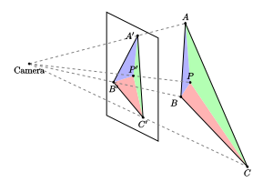

## 前言

众所周知（？） vertex shader 里顶点属性转换成 pixel shader 里逐像素属性需要经过插值，具体来说，是根据像素所在三角形三个顶点的属性，以像素点的重心坐标为权重进行插值。这里的重心坐标不一定是屏幕空间的重心坐标，取决于插值的属性是否使用 `noperspective` 关键字修饰。一般的属性都需要经过透视矫正，[OpenGL spec](https://registry.khronos.org/OpenGL/specs/gl/glspec46.core.pdf) 里给出了矫正公式（见 Basic Polygon Rasterization 一节），但没有给出推导。网络上通常的推导多数是先考虑二维上线段的属性，得到一个透视矫正公式，再类比它与线性插值公式，推广到三维，直接给出重心坐标的透视矫正算法。

事实上，直接在三维下推导出矫正公式也不困难，甚至不需要求交点坐标（以及解方程）就可以得出。

## 推导过程

已知空间中一个三角形的三个顶点为 $A,B,C$, 经过投影矩阵到 NDC 空间下的齐次坐标是 $(X_A, Y_A, Z_A, W_A)$, $(X_B, Y_B, Z_B, W_B)$, $(X_C, Y_C, Z_C, W_C)$, 这里 $W_A, W_B, W_C$ 就是对应的顶点在相机空间下的实际深度. 三角形 $ABC$ 投影到屏幕上仍然是一个三角形, 各顶点的屏幕空间坐标分别是 
$$A'=(\dfrac{X_A}{W_A},\dfrac{Y_A}{W_A}), \qquad B'=(\dfrac{X_B}{W_B},\dfrac{Y_B}{W_B}),\qquad C'=(\dfrac{X_C}{W_C},\dfrac{Y_C}{W_C}). $$
对屏幕上的三角形进行光栅化, 得到一组像素坐标. 对于其中的每个像素, 假设其屏幕空间的二维坐标是 $P'=(u,v)$, 需要求出此处 $A,B,C$ 三个顶点的权重, 以便对顶点属性进行插值. 假设像素 $P'$ 对应于三维空间三角形 $ABC$ 上的点为 $P$, 它的齐次坐标为 $(X_P, Y_P, Z_P, W_P)$, 由 $P$ 点在三角形 $ABC$ 内可得
$$
\begin{align}
X_P &= a\cdot X_A + b\cdot X_B + c\cdot X_C \tag{1} \\\ 
Y_P &= a\cdot Y_A + b\cdot Y_B + c\cdot Y_C \tag{2} \\\ 
W_P &= a\cdot W_A + b\cdot W_B + c\cdot W_C \tag{3}
\end{align}
$$
这里 $a,b,c$ 为 $P$ 的重心坐标, 满足$0\le a,b,c \le 1$, 且
$$a+b+c=1 \tag{4} $$

$a,b,c$ 均为未知量, 需要根据 $P$ 点的屏幕坐标 $P'$ 求出. $A',B',C'$ 与 $P'$ 都是二维屏幕空间上的点, 仍然满足线性插值关系, 只是重心坐标会发生变化, 假设 $(u,v)$ 满足
\\[P' = r\cdot A' + s\cdot B' + t\cdot C'.\\]
展开可得
$$
\begin{align}
u &= r\cdot\frac{X_A}{W_A} + s\cdot\frac{X_B}{W_B} + t\cdot\frac{X_C}{W_C} \tag{5} \\\ 
v &= r\cdot\frac{Y_A}{W_A} + s\cdot\frac{Y_B}{W_B} + t\cdot\frac{Y_C}{W_C} \tag{6}
\end{align}
$$
这里 $r,s,t$ 是 $P'$ 在三角形 $A'B'C'$的重心坐标, 满足 $0\le r,s,t\le 1$, 且
\\[r+s+t=1 \tag{7} \\]
通过求解 $(5),(6),(7)$ 可以求出 $r,s,t$ .事实上求解重心坐标的标准方法是通过面积比, 但本质都一样. 因此实质上 $r,s,t$ 的值也是已知的.

一般情况下, $r,s,t$ 的值与 $a,b,c$ 并不相等, 因为它们满足的关系不同. 由 $P$ 和 $P'$ 的投影关系有
$$u=\dfrac{X_P}{W_P},\qquad v=\dfrac{Y_P}{W_P}$$ 并结合 $(1)(2)$ 可得
$$
\begin{align*}
a\cdot X_A + b\cdot X_B + c\cdot X_C &= u\cdot W_P \\\ 
a\cdot Y_A + b\cdot Y_B + c\cdot Y_C &= v\cdot W_P 
\end{align*}
$$
两式分别除以$W_P$, 得
$$
\begin{align*}
a\cdot\frac{W_A}{W_P}\cdot \frac{X_A}{W_A} + b\cdot\frac{W_B}{W_P}\cdot \frac{X_B}{W_B}+ c\cdot\frac{W_C}{W_P}\cdot \frac{X_C}{W_C} &= u \\\ 
a\cdot\frac{W_A}{W_P}\cdot \frac{Y_A}{W_A} + b\cdot\frac{W_B}{W_P}\cdot \frac{Y_B}{W_B}+ c\cdot\frac{W_C}{W_P}\cdot \frac{Y_C}{W_C} &= v 
\end{align*}
$$
观察到只要令 
$$r = \frac{a\cdot W_A}{W_P}, \qquad s = \frac{b\cdot W_B}{W_P},\qquad t = \frac{c\cdot W_C}{W_P}, $$
则 $(5)(6)(7)$ 都是满足的. 将:
\\[ a = \frac{r\cdot W_P}{W_A}, \qquad b = \frac{s\cdot W_P}{W_B}, \qquad c = \frac{t\cdot W_P}{W_C} \\]
代入 $(4)$, 可得
\\[W_P = \left( \frac{r}{W_A}+ \frac{s}{W_B} + \frac{t}{W_C} \right)^{-1} .\\]
将 $W_P$ 代回去就能求出 $a,b,c$ 的值了.

## demo

以下的例子展示了一个三维空间中的网格，可以按 UE 的交互模式在场景中漫游，从各个角度观察网格，并切换是否使用透视矫正的重心坐标作为插值系数。
<canvas id="drawCanvas" width="1024" height="768"> </canvas>

    <input type="checkbox" id="useCorrection" /> Use Correction

## Bonus: 深度的插值

前面一直忽略了 $Z$ 坐标，现在考虑以下的问题：已知三角形 $ABC$ 三个顶点的齐次坐标，并得到三个顶点的深度缓冲值为 $d_i = \dfrac{Z_i}{W_i}, i=A,B,C $，如何插值得到内部像素 $P$ 点的深度呢？

由三维空间下的重心坐标系数有
$$
\begin{align*}
Z_P &= a\cdot Z_A + b\cdot Z_B + c\cdot Z_C \\\ 
&= \frac{r\cdot W_P Z_A}{W_A} + \frac{s\cdot W_P Z_B}{W_B} + \frac{t\cdot W_P Z_C}{W_C} \\\ 
&= r\cdot d_A W_P + s\cdot d_B W_P + t\cdot d_C W_P
\end{align*}
$$

$P$ 点的深度值为 
$$ d_P = \frac{Z_P}{W_P} = r\cdot d_A + s\cdot d_B + t\cdot d_C $$

可见三角形内部的深度值只需要根据顶点深度值按屏幕空间的重心坐标系数进行插值即可，不需要进行透视矫正。

