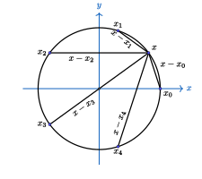
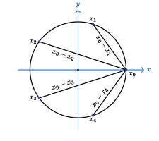
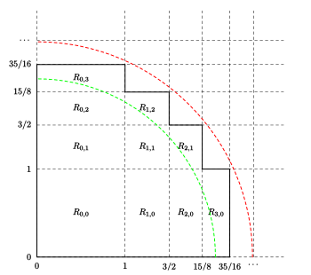

Wallis 乘积公式表述为： 
$$ \frac{\pi}{2} = \frac{2}{1}\cdot\frac{2}{3}\cdot\frac{4}{3}\cdot\frac{4}{5}\cdot\frac{6}{5}\cdot\frac{6}{7}\cdots $$

出现 $\pi$ 的地方或多或少都跟圆能扯上关系，这里介绍两个巧妙的证明方法，都只需要初等的代数和几何知识就可以理解。

---

第一个证明是我在 3b1b 上看到的。

先证明一个引理：单位圆上有 $ N $ 个等分点，其中相邻两个点之间的圆弧的中点到所有这些等分点的直线距离的乘积恒等于 $ 2 $；而某个等分点到其余等分点的直线距离的乘积等于 $ N $。

考虑复数域上的方程 $x^N-1=0 $，它有 $ N $ 个复数根 $ x_k = e^{k\omega i}$，其中 $ \omega = \frac{2\pi}{N}, k=0,1,\cdots,N-1 $。 这些根正好是复平面上单位圆的 $ N $ 个等分点。
所以原方程写成根式的形式：
$$ x^N - 1 = (x - x_0)(x - x_1)\cdots(x-x_{N-1}) .$$ 
它对于任意的复数 $ x $ 当然也是成立的。设 $ f \in (0,1) $，取一点 $ X_f =  e^{f\omega i} $，对应 $ x_0 $ 到 $ x_1 $ 之间占比为 $ f $ 的复数点。
对它取 $ N $ 次方自然是得到整个圆周占比为 $ f $ 的复数点 $e^{2\pi fi}$。 代入上面的公式，并对两边取模得到：
$$ || X_f^N-1 || = ||(X_f-x_0)||\cdot||(X_f - x_1)||\cdots||(X_f-x_{N-1})|| .$$

观察左边是复数 $e^{2\pi fi}$ 到 $ 1 $ 的距离，右边是 $ N $ 个距离的乘积。将 $\displaystyle f = \frac{1}{2} $ 代入，左边是 $ 2 $，右边是 $ x_0 $ 到 $ x_1 $ 之间圆弧的中点到其他各个复数根时间的距离之积。 
引理第一条得证。

<table border="0">
<tr>
<td>

</td>
<td>

</td>
</tr>
</table>

另一方面，为了求出 $ x_0 = 1 $ 到其他根的距离之积，对 $ x^N - 1 $ 做因式分解： 
$$ x^N-1 = (x-1)(1+x+x^2+\cdots+x^{N-1}) ,$$
于是
$$ ||x-x_1||\cdot||x-x_2||\cdots||x-x_{N-1}|| = \frac{||x^N-1||}{||x-1||} = || 1+x+x^2+\cdots+x^{N-1} || .$$ 
把 $ x = 1 $ 代入上式，左边是其中一个根到其他所有根的距离之积，右边是 $ N $，引理第二条也得证。

然后，考虑两个点 $ A = 1, B = e^{\frac{1}{2}\omega i} $，并记单位圆上 $ A $ 点逆时针方向的等分点为 $ x_1, x_2, \cdots $，顺时针方向的点为 $ x_{-1}, x_{-2}, \cdots $。计算下面的比值：
$$ P = \frac{||A-x_1||}{||B-x_1||} \frac{||A-x_{-1}||}{||B-x_{-1}||} \cdot \frac{||A-x_2||}{||B-x_2||} \frac{||A-x_{-2}||}{||B-x_{-2}||} \cdots $$

根据上面的引理，可以得：
$$
\begin{aligned}
||A-x_1||\cdot ||A-x_{-1}||\cdot||A-x_2||\cdot||A-x_{-2}||\cdots &= N \\\ 
||B-A||\cdot||B-x_1||\cdot ||B-x_{-1}||\cdot||B-x_2||\cdot||B-x_{-2}||\cdots &= 2
\end{aligned}
$$
比较一下，可以得到 
$$ P =  \frac{N||B-A||}{2}.$$

弦 $ AB $ 的圆心角为 $ \theta=\dfrac{2\pi}{2N} $，当 $ N $ 很大时，这个角度很小， 则弦长近似等于弧长， 半径为$ 1 $， 所以 
$$ ||B-A|| = \frac{2\pi}{2N}\cdot 1 .$$
代入得到
$$ P = \frac{N||B-A||}{2} = \frac{\pi}{2} $$

同样的，再看 $ A $ 到点 $ x_{\pm k} $ 的弧对应的圆心角都是 $ 2k\theta $，点 $ B $ 到 $ x_{\pm k} $ 的圆心角分别是 $ (2k\pm 1)\theta $。 
当 $ N $ 很大时，弦长近似等于弧长。原来 $ P $ 的表达式右边的连乘式为： 
$$ P = \frac{||A-x_1||}{||B-x_1||} \frac{||A-x_{-1}||}{||B-x_{-1}||} \cdot \frac{||A-x_2||}{||B-x_2||} \frac{||A-x_{-2}||}{||B-x_{-2}||} \cdots = \frac{2}{1}\cdot\frac{2}{3}\cdot\frac{4}{3}\cdot\frac{4}{5}\cdot\frac{6}{5}\cdot\frac{6}{7}\cdots .$$
这也就证明了 Wallis 公式。

---

第二种证法来自 MAA Monthly，采用的是夹逼的策略，先定义序列 $s_n$, 
其中 $ s_1= 1 $，对于 $ n \ge 2 $， 
$$ s_n = \frac{3}{2}\cdot\frac{5}{4}\cdots\frac{2n-1}{2n-2} .$$
再定义 $ o_n $ 和 $ e_n $：
$$
\begin{aligned}
o_n &= \frac{2^2\cdot 4^2\cdots (2n-2)^2\cdot (2n)}{1\cdot 3^2\cdots (2n-1)^2} = \frac{2n}{s_n^2} ,\\\ 
e_n &= \frac{2^2\cdot 4^2\cdots (2n-2)^2}{1\cdot 3^2\cdots (2n-3)^2\cdot (2n-1)} = \frac{2n-1}{s_n^2} .
\end{aligned}
$$
显然有 $ e_n < e_{n+1} $ 和 $ o_n > o_{n+1} $, 以及 $ e_n < o_n $。于是：
$$ e_1 < e_2 < e_3 < \cdots < o_3 < o_2 < o_1 .$$
所以，对于 $ 1\le i < n $，有 $$ \frac{2i}{s_i^2}=o_i\ge o_n $$ 和 $$ \frac{2i-1}{s_i^2}=e_i\le e_n ,$$
可以推出 $$ \frac{2i-1}{e_n}\le s_i^2\le \frac{2i}{o_n} .$$

如果定义 $ s_0 = 0 $，则上面的不等式对于 $ i = 0 $ 也是成立的。
记 $ a_n = s_{n+1} - s_n $，观察到 $ a_0 = 1 $，对于 $ n \ge 1 $，
$$ a_n = s_{n+1}-s_n = s_n\left(\frac{2n+1}{2n} - 1 \right) = \frac{s_n}{2n} = \frac{1}{2}\cdot\frac{3}{4}\cdots\frac{2n-1}{2n} .$$

对于任意 $ i, j $，因为 $$ a_{i+1} = \frac{2i+1}{2(i+1)}a_i $$
考虑下面的和：
$$
\begin{aligned}
&\ \frac{j+1}{i+j+1}a_i a_{j+1} + \frac{i+1}{i+j+1}a_{i+1}a_j \\\ 
=&\ \frac{a_i a_j}{i+j+1}\cdot\left((j+1)\frac{2j+1}{2(j+1)} + (i+1)\frac{2i+1}{2(i+1)}\right) \\\ 
=&\ a_i a_j.
\end{aligned}
$$
由这个等式可以得到递推的等式: 
$$
\begin{aligned}
 &\ a_0a_{n-1}+a_1a_{n-2}+\cdots+a_{n-1}a_0 \\\ 
= &\ \left(a_0a_n+\frac{1}{n}a_1a_{n-1}\right)+\left(\frac{n-1}{n}a_1a_{n-1}+\frac{2}{n}a_2a_{n-2}\right)+\cdots+\left(\frac{1}{n}a_{n-1}a_1+a_na_0\right) \\\ 
 = &\ a_0a_n + a_1a_{n-2} + \cdots + a_na_0 . 
\end{aligned}
$$
从 $ i = j = 0 $ 出发，反复应用上面的等式，可以得到 
$$
\begin{aligned}
1 &= a_0^2 = a_0a_1 + a_1a_0 = a_0a_2+a_1^2+a_2a_0 = \cdots \\\ 
  &= a_0a_n + a_1a_{n-1} + \cdots + a_na_0 .
\end{aligned}
$$

将 $ xy $ 平面第一象限划分成一些矩形区域，矩形的边分别是 $ x = s_n $ 和 $ y = s_n $，
令 $ R_{i,j} $ 是左下角为 $ (s_i, s_j) $，右上角为 $ (s_{i+1}, s_{j+1} ) $ 的矩形。 
记矩形 $ R_{i,j} $ 的面积为 $ a_{i,j} $，根据上一个等式，所有满足 $ i + j = n $ 的矩形 $ R_{i,j} $ 的面积之和是 $ 1 $。 
令 $ P_n $ 是 所有满足 $ i+j < n $ 的矩形构成的多边形区域，可知 $ P_n $ 的面积是 $ n $。
下图显示了 $ P_4 $ 包含的区域。

多边形 $P_n $ 往外凸的点是集合 $\\{ (s_i, s_j)\ |\ \ i+j=n+1,\ 1\le i,j \le n \\}$。 
这些点到原点的距离是 $ \sqrt{s_i^2+s_j^2} $。 
根据前面推出的 $ s_i $ 与 $ o_n $ 的大小关系有
$$ \sqrt{s_i^2+s_j^2} \le \sqrt{\frac{2i+2j}{o_n}} = \sqrt{\frac{2(n+1)}{o_n}} .$$

类似的，这个多边形向内凹的点是集合  $\\{ (s_k, s_l)\ |\ \ k+l=n,\ 0\le k,l \le n \\}$。 
根据前面推出的 $ s_i $ 与 $ e_n $ 的大小关系有
$$ \sqrt{s_k^2+s_l^2} \ge \sqrt{\frac{2k+2l-2}{e_n}} = \sqrt{\frac{2(n-1)}{e_n}} .$$

也就是说，多边形 $ P_n $ 的边被夹在半径为 $ \sqrt{2(n-1)/e_n} $ 和 $ \sqrt{2(n+1)/o_n} $ 的两个四分之一圆之间。 
上面的图中也画出了这两个圆。 
于是他们的面积满足关系
$$ \pi\cdot\frac{n-1}{2e_n} \le n \le \pi\cdot\frac{n+1}{2o_n} ,$$
所以 $$ \frac{(n-1)\pi}{2n} \le e_n < o_n \le \frac{(n+1)\pi}{2n} .$$
当 $ n  \rightarrow  \infty $ 时，不等式两边都是 $ \pi/2 $， 而 $ e_n $ 和 $ o_n $ 也都是 Wallis 乘积。 故命题得证。
